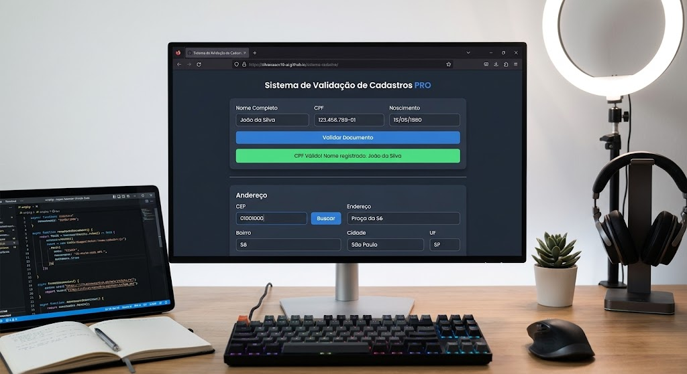
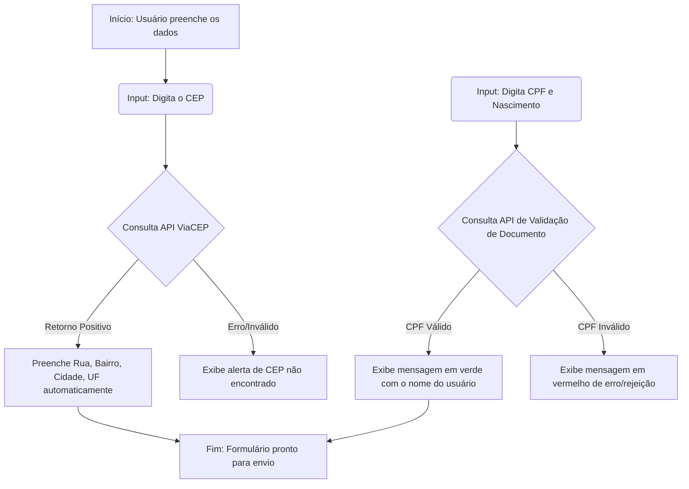

# sistema-cadastro
## Aplicação web focada em otimizar formulários. Reduz o tempo de preenchimento e evita erros de digitação ao buscar endereços automaticamente pelo CEP e validar CPFs em tempo real.
# Sistema de Validação e Autopreenchimento de Cadastros

## Descrição
Sistema web moderno focado em otimizar formulários de cadastro. A aplicação consome APIs externas para preenchimento automático de endereços via CEP e verificação instantânea de validade de CPF, melhorando a experiência do usuário e a precisão dos dados inseridos.

<h1 align="center">Sistema de Validação de Cadastros PRO</h1>

  

## 📌 Índice
* [Descrição do Projeto](#-descrição-do-projeto)
* [Status do Projeto](#-status-do-projeto)
* [Funcionalidades e Demonstração da Aplicação](#-funcionalidades-e-demonstração-da-aplicação)
* [Fluxo do Sistema](#-fluxo-do-sistema)
* [Tecnologias Utilizadas](#-tecnologias-utilizadas)
* [Pessoas Desenvolvedoras](#-pessoas-desenvolvedoras)
* [Licença](#-licença)

## 📝 Descrição do Projeto
Este projeto consiste em uma interface web (Dark Mode) projetada para agilizar processos de registro de usuários. O sistema elimina a necessidade de digitação manual extensa e reduz erros cadastrais ao buscar automaticamente os dados de endereço a partir do **CEP** e validar na base de dados o **CPF** atrelado à data de nascimento.

**Resumo:** O usuário preenche seus dados básicos. Ao inserir o CEP, o sistema consulta a base dos Correios e preenche instantaneamente os campos de Rua, Bairro, Cidade e Estado. Ao preencher o CPF e Nascimento, o sistema faz uma validação assíncrona e entrega um feedback visual imediato (sucesso com o nome do titular ou erro).

## 🚧 Status do Projeto
✅ **Status: Concluído** - A interface responsiva e a integração com as APIs REST (ViaCEP e validador de CPF) já estão totalmente funcionais e hospedadas na nuvem.

## ⚙️ Funcionalidades e Demonstração da Aplicação
- `Funcionalidade 1`: Interface gráfica moderna em Dark Mode, totalmente responsiva (mobile-friendly).
- `Funcionalidade 2`: Integração assíncrona com a API **ViaCEP** para preenchimento automático de endereço.
- `Funcionalidade 3`: Integração com serviço de validação em tempo real de **CPF**, retornando o status e o nome do titular.
- `Funcionalidade 4`: Tratamento de erros, sanitização de inputs (removendo letras de campos numéricos) e feedback visual intuitivo em cores (verde/vermelho).

Abaixo, uma imagem ilustrativa da interface do sistema em funcionamento:

* *

## 📊 Fluxo do Sistema
Para facilitar o entendimento técnico do consumo das APIs, segue o organograma de como a aplicação lida com as requisições:

##    🛠 Tecnologias Utilizadas
HTML5 (Estruturação semântica e organização de blocos)

CSS3 (Estilização avançada, Flexbox, transições fluidas e paleta Dark Mode)

JavaScript Vanilla (Lógica assíncrona com async/await, consumo de APIs REST via fetch e manipulação direta do DOM)

Git & GitHub (Versionamento de código e deploy contínuo via GitHub Pages)

## 👨‍💻 Pessoas Desenvolvedoras
    * **Isaac Victor Mariano Silva**  
  *Autor e Desenvolvedor*  
  [🔗 LinkedIn](https://www.linkedin.com/in/isaac-victor-mariano-silva-92517742b)  
  [🌐 Portfólio Oficial - Isaac Nexus IA](https://isaacnexusia.lovable.app)

## 📄 Licença
O projeto foi desenvolvido para fins educacionais e de demonstração de portfólio técnico. 